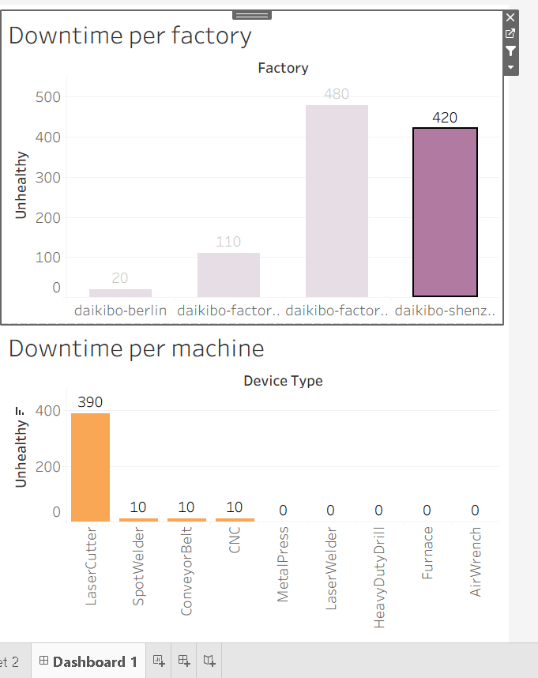

# Deloitte Data Analytics Job Simulation (Forage)

## Overview

Completed Deloitte Australia's Data Analytics Virtual Experience on Forage, focusing on solving real-world business problems using data.

## Problem Statement

Analyze machine downtime data to identify inefficiencies and provide actionable insights to improve operational performance.

## Project Work

* Cleaned and transformed raw datasets using Excel
* Built an interactive Tableau dashboard to visualize downtime trends
* Analyzed patterns to identify root causes of machine failures
* Generated insights to support business decision-making

## Tools Used

* Excel
* Tableau

## Skills Demonstrated

* Data Analysis
* Data Modeling
* Data Visualization
* Spreadsheet Skills (Excel)
* Data Structures
* Python Programming
* Programming & Software Development
* Log Analysis
* Planning & Problem Solving
* Formal Communication
* Computer Networking (Basic Understanding)
* Web Security (Fundamentals)

## Key Insights

* Identified machines with the highest downtime
* Detected peak failure periods impacting productivity
* Suggested improvements for operational efficiency

## Dashboard Preview

